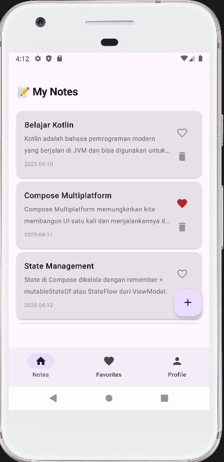
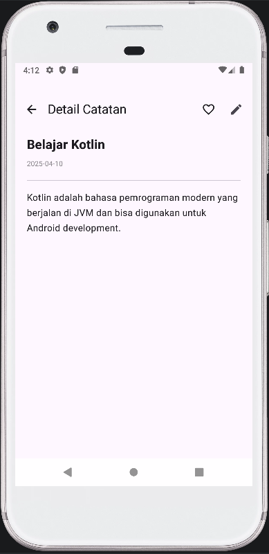
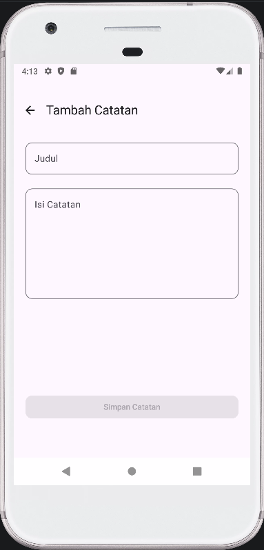
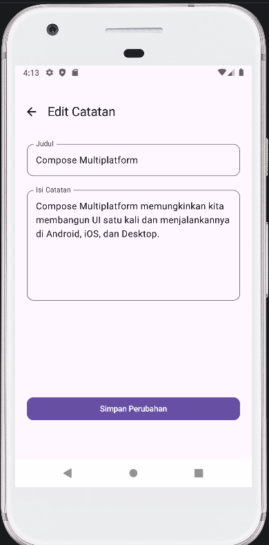
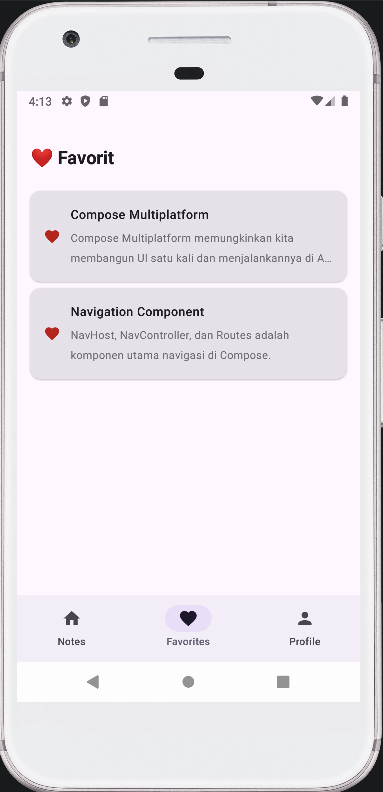
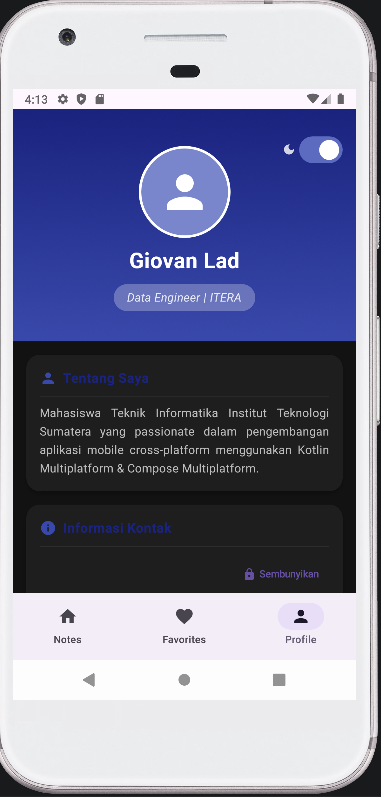

# Notes App 📝 — Tugas Praktikum Minggu 5

Pengembangan **Notes App** dengan fitur navigasi multi-screen berbasis **Kotlin Multiplatform + Compose Multiplatform**.

> Tugas Praktikum Minggu 5 — IF25-22017 Pengembangan Aplikasi Mobile  
> Institut Teknologi Sumatera  
> **Nama:** Giovan Lado  
> **NIM:** 123140068  
> **Branch:** `week-5`

---

## Fitur yang Diimplementasikan

| # | Fitur | Status |
|---|-------|--------|
| 1 | Bottom Navigation (Notes, Favorites, Profile) | ✅ |
| 2 | Note List → Note Detail dengan passing `noteId` | ✅ |
| 3 | Floating Action Button → Add Note Screen | ✅ |
| 4 | Back navigation yang proper dari semua screens | ✅ |
| 5 | Edit Note screen dengan passing `noteId` sebagai argument | ✅ |

---

## Navigation Flow Diagram

```
╔══════════════════════════════════════════════════════╗
║           BOTTOM NAVIGATION BAR                      ║
║    [📝 Notes]   [❤️ Favorites]   [👤 Profile]        ║
╚══════════════════════════════════════════════════════╝
         │               │               │
         ▼               ▼               ▼
    ┌─────────┐    ┌───────────┐    ┌─────────┐
    │  Notes  │    │ Favorites │    │ Profile │
    │  Screen │    │  Screen   │    │ Screen  │
    └────┬────┘    └─────┬─────┘    └─────────┘
         │               │
    [Klik Note]     [Klik Note]
         │               │
         └───────┬────────┘
                 ▼
         ┌───────────────┐
         │  Note Detail  │◀─────────────────┐
         │    Screen     │                  │
         └───────┬───────┘                  │
                 │                          │
            [Klik Edit]                  [Back]
                 │                          │
                 ▼                          │
         ┌───────────────┐                  │
         │  Edit Note    │──────────────────┘
         │    Screen     │
         └───────────────┘

    [FAB +]
         │
         ▼
    ┌───────────┐
    │ Add Note  │
    │  Screen   │
    └───────────┘
```

**Route Arguments:**
- `note_detail/{noteId}` → `noteId: Int`
- `edit_note/{noteId}` → `noteId: Int`

---

## Struktur Folder

```
composeApp/src/commonMain/kotlin/com/example/myprofile/
│
├── App.kt                          ← Entry point, Scaffold + BottomNav
│
├── navigation/
│   ├── Screen.kt                   ← Sealed class route definitions
│   └── AppNavigation.kt            ← NavHost dengan semua destinations
│
├── screens/
│   ├── NotesScreen.kt              ← Daftar catatan + FAB Add Note
│   ├── NoteDetailScreen.kt         ← Detail catatan (passing noteId)
│   ├── AddNoteScreen.kt            ← Form tambah catatan baru
│   ├── EditNoteScreen.kt           ← Form edit catatan (passing noteId)
│   ├── FavoritesScreen.kt          ← Daftar catatan favorit
│   └── ProfileScreen.kt            ← Profil pengguna
│
├── components/
│   └── BottomNavBar.kt             ← NavigationBar dengan 3 tabs
│
├── data/
│   ├── NoteRepository.kt           ← CRUD operations untuk Note
│   ├── NoteUiState.kt              ← UI state untuk Notes
│   ├── ProfileRepository.kt        ← Persistent storage profil
│   └── ProfileUiState.kt           ← UI state untuk Profile
│
├── model/
│   ├── Note.kt                     ← Data class Note
│   └── ProfileData.kt              ← Data class Profile
│
├── viewmodel/
│   ├── NoteViewModel.kt            ← ViewModel untuk Notes
│   └── ProfileViewModel.kt         ← ViewModel untuk Profile
│
├── ui/                             ← Reusable UI components (dari minggu lalu)
│   ├── ProfileHeader.kt
│   ├── ProfileCard.kt
│   ├── InfoItem.kt
│   ├── EditProfileForm.kt
│   └── SkillChip.kt
│
└── theme/
    └── Theme.kt                    ← Warna dan konstanta tema
```

---

## Penjelasan Navigation Component

### `Screen.kt` — Route Definitions
```kotlin
sealed class Screen(val route: String) {
    object Notes     : Screen("notes")
    object Favorites : Screen("favorites")
    object Profile   : Screen("profile")

    object NoteDetail : Screen("note_detail/{noteId}") {
        fun createRoute(noteId: Int) = "note_detail/$noteId"
    }
    object EditNote : Screen("edit_note/{noteId}") {
        fun createRoute(noteId: Int) = "edit_note/$noteId"
    }
    object AddNote : Screen("add_note")
}
```

### Passing Arguments antar Screen
```kotlin
// Navigate dengan argument
navController.navigate(Screen.NoteDetail.createRoute(noteId = 42))
// → route: "note_detail/42"

// Menerima argument di destination
composable(
    route = Screen.NoteDetail.route,
    arguments = listOf(navArgument("noteId") { type = NavType.IntType })
) { backStackEntry ->
    val noteId = backStackEntry.arguments?.getInt("noteId") ?: return@composable
    NoteDetailScreen(noteId = noteId, ...)
}
```

### Bottom Navigation dengan `launchSingleTop`
```kotlin
navController.navigate(item.route) {
    popUpTo(Screen.Notes.route) { saveState = true }
    launchSingleTop = true
    restoreState = true
}
```

---

## Screenshot dan Video

### Link Youtube
https://youtube.com/shorts/YlGOKDrK72U?feature=share 

### 📝 Notes Screen


### 🔍 Note Detail Screen


### ➕ Add Note Screen
 

### ✏️ Edit Note Screen


### ❤️ Favorites Screen


### 👤 Profile Screen
 

---

## Cara Build & Menjalankan

### Android
```bash
./gradlew :composeApp:assembleDebug
```
Atau klik **Run** di Android Studio dengan konfigurasi `composeApp`.

### Desktop
```bash
./gradlew :composeApp:run
```

---

## Dependencies Utama

```toml
# gradle/libs.versions.toml
composeMultiplatform = "1.10.0"
androidx-lifecycle   = "2.9.6"
navigation           = "2.9.0-beta01"
multiplatformSettings = "1.1.1"
```

```kotlin
// composeApp/build.gradle.kts — commonMain
implementation(libs.compose.material3)
implementation(libs.compose.materialIconsExtended)
implementation(libs.androidx.lifecycle.viewmodelCompose)
implementation(libs.androidx.lifecycle.runtimeCompose)
implementation(libs.androidx.navigation.compose)
implementation(libs.multiplatform.settings)
```

---

## Perubahan dari Minggu 4

| Minggu 4 | Minggu 5 |
|----------|----------|
| Single screen (Profile only) | Multi-screen dengan Bottom Navigation |
| Tidak ada navigasi | NavHost + NavController + Routes |
| Tidak ada Notes feature | Full Notes CRUD (Add, View, Edit, Delete, Favorite) |
| `App.kt` berisi semua UI | UI dipecah ke `screens/`, `navigation/`, `components/` |

---
