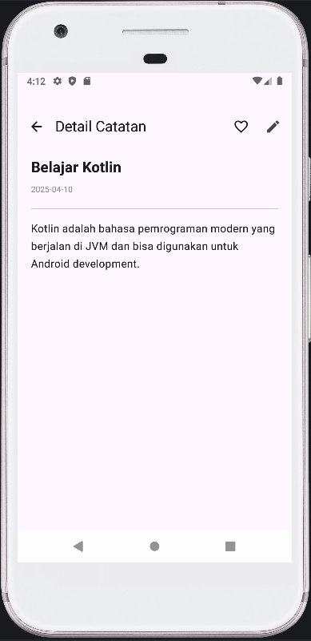
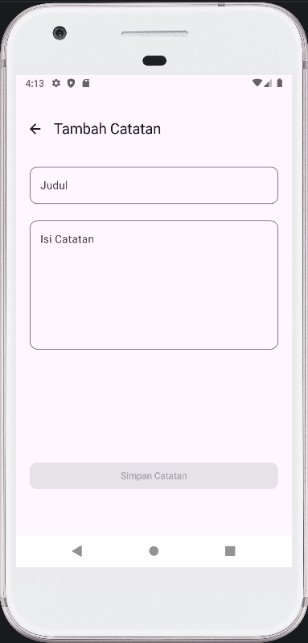

# Notes App 📝 — Tugas Praktikum Minggu 7

Upgrade **Notes App** dengan **Local Data Storage**: SQLDelight (database) untuk notes dan DataStore (multiplatform-settings) untuk preferences, dilengkapi search, offline-first architecture, dan UI states yang proper. Dibangun dengan **Kotlin Multiplatform + Compose Multiplatform**.

> Tugas Praktikum Minggu 7 — IF25-22017 Pengembangan Aplikasi Mobile
> Institut Teknologi Sumatera
> **Nama:** Giovan Lado
> **NIM:** 123140068
> **Branch:** `week-7`

---

## Fitur yang Diimplementasikan

| # | Fitur | Status |
|---|-------|--------|
| 1 | SQLDelight database untuk menyimpan notes | ✅ |
| 2 | CRUD operations (Create, Read, Update, Delete) | ✅ |
| 3 | Search functionality untuk mencari notes | ✅ |
| 4 | Settings screen dengan DataStore (theme & sort order) | ✅ |
| 5 | Offline-first: semua data tersimpan & berfungsi secara lokal | ✅ |
| 6 | UI states yang proper (loading, empty, content, error) | ✅ |
| 7 | Reactive UI dengan Flow + StateFlow | ✅ |
| 8 | Favorite notes (bonus dari fitur minggu sebelumnya) | ✅ |

---

## Database Schema (SQLDelight)

File: `composeApp/src/commonMain/sqldelight/com/example/myprofile/db/Note.sq`

```sql
CREATE TABLE NoteEntity (
    id          INTEGER PRIMARY KEY AUTOINCREMENT,
    title       TEXT    NOT NULL,
    content     TEXT    NOT NULL,
    is_favorite INTEGER NOT NULL DEFAULT 0,
    created_at  INTEGER NOT NULL,
    updated_at  INTEGER NOT NULL
);
```

### Queries

| Query | Deskripsi |
|-------|-----------|
| `selectAll` | Ambil semua notes, urut `updated_at DESC` |
| `selectById` | Ambil 1 note berdasarkan `id` |
| `selectByQuery` | Search notes berdasarkan `title` atau `content` (LIKE) |
| `selectFavorites` | Ambil notes dengan `is_favorite = 1` |
| `insert` | Tambah note baru |
| `update` | Update `title`, `content`, `updated_at` |
| `toggleFavorite` | Toggle status favorite (0 ↔ 1) |
| `delete` | Hapus note berdasarkan `id` |
| `countAll` | Hitung jumlah seluruh notes |

### Database Driver (expect/actual)

| Platform | Driver | File |
|----------|--------|------|
| Android | `AndroidSqliteDriver` | `DatabaseDriverFactory.android.kt` |
| iOS | `NativeSqliteDriver` | `DatabaseDriverFactory.ios.kt` |
| Desktop (JVM) | `JdbcSqliteDriver` (in-memory) | `DatabaseDriverFactory.jvm.kt` |

---

## DataStore / Settings (multiplatform-settings)

File: `data/SettingsRepository.kt`

| Key | Tipe | Default | Opsi |
|-----|------|---------|------|
| `app_theme` | String | `"system"` | `system`, `light`, `dark` |
| `sort_order` | String | `"newest"` | `newest`, `oldest`, `title` |

- Disimpan menggunakan `com.russhwolf.settings.Settings` (Android → SharedPreferences, iOS → NSUserDefaults).
- Setiap perubahan langsung dipancarkan melalui `StateFlow` (`themeFlow`, `sortOrderFlow`) sehingga UI auto-update.
- **Theme**: diterapkan langsung di `App.kt` melalui `MaterialTheme(colorScheme = ...)`, dikombinasikan dengan `isSystemInDarkTheme()` untuk opsi *system*.
- **Sort Order**: diterapkan di `NoteViewModel.uiState` — notes di-sort ulang sesuai preferensi (`newest`, `oldest`, atau `title A-Z`).

---

## Arsitektur & Data Flow

```
┌─────────────┐     Flow/StateFlow      ┌──────────────────┐
│  Compose UI │ ◀──────────────────────▶│   ViewModel       │
│ (Screens)   │                         │ (NoteViewModel,   │
└─────────────┘                         │  SettingsViewModel)│
                                         └─────────┬─────────┘
                                                    │
                          ┌─────────────────────────┴───────────────────┐
                          ▼                                              ▼
                ┌───────────────────┐                       ┌──────────────────────┐
                │  NoteRepository    │                       │ SettingsRepository    │
                │  (SQLDelight)      │                       │ (multiplatform-       │
                │                    │                       │  settings)            │
                └─────────┬──────────┘                       └──────────┬───────────┘
                          ▼                                              ▼
                ┌───────────────────┐                       ┌──────────────────────┐
                │  NotesDatabase     │                       │  SharedPreferences /  │
                │  (SQLite, lokal)   │                       │  NSUserDefaults       │
                └────────────────────┘                       └──────────────────────┘
```

- **Single Source of Truth**: `NotesDatabase` (SQLite lokal) adalah satu-satunya sumber data untuk daftar notes.
- **Reactive Updates**: `queries.selectAll().asFlow().mapToList()` membuat UI otomatis update setiap ada perubahan data (insert/update/delete/toggle favorite).
- **Offline-First**: Tidak ada dependensi ke server — seluruh fitur (CRUD, search, favorite, settings) tetap berjalan penuh tanpa koneksi internet karena data disimpan permanen di SQLite lokal & local storage settings.
- **UI States**: `NotesUiState` (`Loading`, `Empty`, `Content`, `Error`) memastikan setiap kondisi data ditampilkan dengan benar di `NotesScreen` dan `FavoritesScreen`.

---

## Struktur Folder (bagian baru/relevan Minggu 7)

```
composeApp/src/
│
├── commonMain/
│   ├── kotlin/com/example/myprofile/
│   │   ├── App.kt                      ← Setup database, settings, theme
│   │   │
│   │   ├── data/
│   │   │   ├── NoteRepository.kt       ← CRUD + search + favorite (SQLDelight)
│   │   │   ├── NoteUiState.kt          ← Loading/Empty/Content/Error
│   │   │   ├── SettingsRepository.kt   ← Theme & sort order (DataStore)
│   │   │   └── ProfileRepository.kt
│   │   │
│   │   ├── database/
│   │   │   └── DatabaseDriverFactory.kt ← expect class
│   │   │
│   │   ├── viewmodel/
│   │   │   ├── NoteViewModel.kt        ← search, sort, CRUD actions
│   │   │   └── SettingsViewModel.kt    ← theme & sort order actions
│   │   │
│   │   ├── screens/
│   │   │   ├── NotesScreen.kt          ← List + search + UI states + FAB
│   │   │   ├── NoteDetailScreen.kt
│   │   │   ├── AddNoteScreen.kt
│   │   │   ├── EditNoteScreen.kt
│   │   │   ├── FavoritesScreen.kt
│   │   │   └── SettingsScreen.kt       ← Theme & sort order UI
│   │   │
│   │   └── navigation/
│   │       ├── Screen.kt               ← + route "settings"
│   │       └── AppNavigation.kt
│   │
│   └── sqldelight/com/example/myprofile/db/
│       └── Note.sq                     ← Schema & queries
│
├── androidMain/.../DatabaseDriverFactory.android.kt  ← AndroidSqliteDriver
├── iosMain/.../DatabaseDriverFactory.ios.kt          ← NativeSqliteDriver
└── jvmMain/.../DatabaseDriverFactory.jvm.kt          ← JdbcSqliteDriver
```

---

## Penjelasan Implementasi Kunci

### 1. Repository dengan Reactive Flow
```kotlin
class NoteRepository(private val database: NotesDatabase) {
    private val queries = database.noteQueries

    fun getAllNotes(): Flow<List<NoteEntity>> =
        queries.selectAll().asFlow().mapToList(Dispatchers.Default)

    fun searchNotes(query: String): Flow<List<NoteEntity>> {
        val like = "%$query%"
        return queries.selectByQuery(like, like).asFlow().mapToList(Dispatchers.Default)
    }

    suspend fun insertNote(title: String, content: String) {
        val now = Clock.System.now().toEpochMilliseconds()
        withContext(Dispatchers.Default) { queries.insert(title, content, now, now) }
    }
    // updateNote, toggleFavorite, deleteNote ...
}
```

### 2. ViewModel — Search + Sort Order Reaktif
```kotlin
val uiState: StateFlow<NotesUiState> = combine(
    _searchQuery, settingsRepository.sortOrderFlow
) { query, _ -> query }
    .flatMapLatest { query ->
        if (query.isBlank()) repository.getAllNotes()
        else repository.searchNotes(query)
    }
    .combine(settingsRepository.sortOrderFlow) { notes, sortOrder ->
        when (sortOrder) {
            SettingsRepository.SORT_OLDEST -> notes.sortedBy { it.updated_at }
            SettingsRepository.SORT_TITLE  -> notes.sortedBy { it.title.lowercase() }
            else -> notes
        }
    }
    .map { if (it.isEmpty()) NotesUiState.Empty else NotesUiState.Content(it) }
    .onStart { emit(NotesUiState.Loading) }
    .catch { e -> emit(NotesUiState.Error(e.message ?: "Unknown error")) }
    .stateIn(viewModelScope, SharingStarted.WhileSubscribed(5_000), NotesUiState.Loading)
```

### 3. Settings dengan multiplatform-settings
```kotlin
class SettingsRepository(private val settings: Settings) {
    var theme: String
        get() = settings[KEY_THEME, THEME_SYSTEM]
        set(value) { settings[KEY_THEME] = value; _theme.value = value }

    var sortOrder: String
        get() = settings[KEY_SORT_ORDER, SORT_NEWEST]
        set(value) { settings[KEY_SORT_ORDER] = value; _sortOrder.value = value }
}
```

### 4. UI States di NotesScreen
```kotlin
when (val state = uiState) {
    is NotesUiState.Loading -> CircularProgressIndicator()
    is NotesUiState.Empty   -> EmptyState(searchQuery)
    is NotesUiState.Content -> LazyVerticalStaggeredGrid { /* notes grid */ }
    is NotesUiState.Error   -> Text(state.message, color = MaterialTheme.colorScheme.error)
}
```

---

## Screenshot dan Video

### Link Demo Video (45 detik)
_(tambahkan link YouTube/Drive di sini — tunjukkan CRUD, search, settings, dan offline mode)_

### 📝 Notes Screen (dengan search & UI states)


### 🔍 Note Detail Screen


### ➕ Add Note Screen


### ✏️ Edit Note Screen


### ❤️ Favorites Screen


### ⚙️ Settings Screen (Theme & Sort Order)


### 📡 Offline Mode Demo


---

## Cara Build & Menjalankan

### Android
```bash
./gradlew :composeApp:assembleDebug
```
Atau klik **Run** di Android Studio dengan konfigurasi `composeApp`.

### Desktop
```bash
./gradlew :composeApp:run
```

---

## Dependencies Utama

```toml
# gradle/libs.versions.toml
composeMultiplatform  = "1.10.0"
androidx-lifecycle    = "2.9.6"
navigation            = "2.9.0-beta01"
multiplatformSettings = "1.1.1"
sqldelight            = "2.0.2"
kotlinx-datetime      = "0.6.1"
```

```kotlin
// composeApp/build.gradle.kts — commonMain
implementation(libs.sqldelight.runtime)
implementation(libs.sqldelight.coroutines)
implementation(libs.multiplatform.settings)
implementation(libs.multiplatform.settings.noarg)
implementation(libs.kotlinx.datetime)
```

```kotlin
// SQLDelight database configuration
sqldelight {
    databases {
        create("NotesDatabase") {
            packageName = "com.example.myprofile.db"
        }
    }
}
```

---

## Perubahan dari Minggu 5 → Minggu 7

| Minggu 5 | Minggu 7 |
|----------|----------|
| Data notes di-mock / in-memory | Notes disimpan permanen di **SQLite via SQLDelight** |
| Belum ada search | **Search functionality** (query SQL `LIKE`) |
| Belum ada halaman Settings | **Settings Screen** dengan DataStore (tema & sort order) |
| Tema statis | Tema **system/light/dark**, tersimpan & reaktif via `Settings` |
| Belum ada penanganan state data | **UI States**: Loading, Empty, Content, Error |
| Belum offline-first | **Offline-first**: seluruh data & preferences tersimpan lokal, aplikasi berfungsi penuh tanpa internet |

---

## Checklist Pengumpulan

- [x] SQLDelight database (`Note.sq`, driver per platform)
- [x] CRUD operations lengkap (Create, Read, Update, Delete)
- [x] Search functionality
- [x] Settings screen dengan DataStore (theme, sort order)
- [x] Offline-first (data tersimpan lokal)
- [x] UI states (loading, empty, content, error)
- [ ] Push ke GitHub repository (branch: `week-7`)
- [ ] Screenshot semua screens (folder `screenshots/`)
- [ ] Video demo (45 detik): CRUD, search, settings, offline mode
